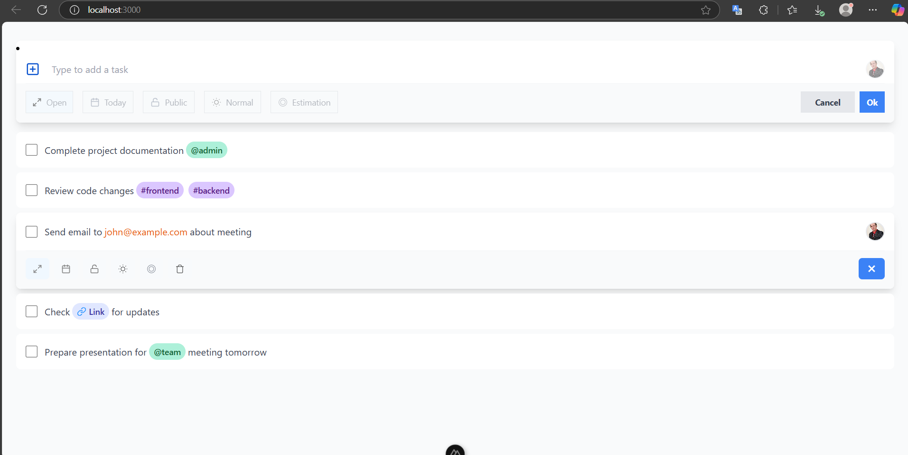
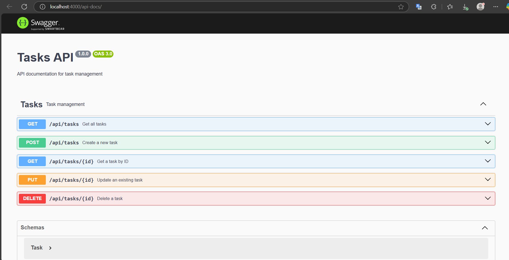

# Task Management

This project is an application for task management, consisting of a robust backend and a modern frontend. It allows you to create, list, update, and delete tasks, making it easier to organize and track activities.

The frontend features a responsive design, implementing UI/CI (User Interface/Interface Consistency) principles, ensuring an optimal experience on any device.

## Tools Used

### Backend
- [x] Main language: TypeScript
- [x] Framework: Express
- [x] ORM: TypeORM
- [x] Documentation: Swagger
- [x] Database: PostgreSQL

### Frontend
- [x] Framework: Nuxt
- [x] Language: JavaScript
- [x] Styles: Tailwind CSS
- [x] Responsive design and UI/CI

### Other tools
- [x] Git
- [x] Docker (optional for deployment)

## Screenshots

Below are some images of the project in action:




## Prerequisites

Before installing the project, make sure you have installed:

- Node.js >= 18
- PostgreSQL
- Git
- (Optional) Docker

## Installation

> **Note:** The backend and frontend are in different branches within this same repository. You must deploy the backend first and then the frontend.
>
> **Important:** Before starting each service, make sure to create the `.env` file with the environment variables specified in the documentation of each branch (backend and frontend).

1. Clone the repository:
   ```bash
   git clone https://github.com/user/repository.git
   ```
2. Go to the project folder:
   ```bash
   cd project_name
   ```
3. Switch to the backend branch and deploy the backend:
   ```bash
   git checkout backend
   cd backend
   npm install
   # Set up the environment variables for PostgreSQL connection
   npm run start
   ```
4. In a new terminal, switch to the frontend branch and deploy the frontend:
   ```bash
   git checkout frontend
   cd frontend
   npm install
   npm run dev
   ```

## Usage

Access the frontend from your browser to manage tasks. The frontend communicates with the backend through a REST API documented in Swagger.

## Contributions

Contributions are welcome. Please open an issue or a pull request for suggestions or improvements.

## License

Specify the project license here (e.g., MIT, GPL, etc.).

## Additional Notes

- The API documentation is available at the `/api-docs` route of the backend (Swagger).
- You can customize the frontend design by modifying the styles in Tailwind CSS.
- For production deployment, it is recommended to use Docker.
